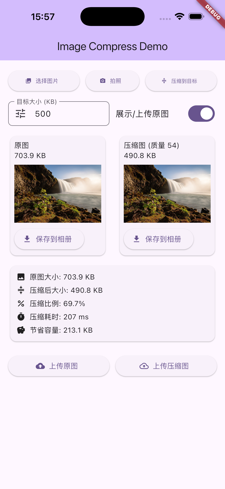

# flutter_image_compress

## introduce

🚀 The Ultimate Flutter Image Compression Tool
Simply set a maximum file size, and our smart algorithm instantly delivers images with the smallest size and the highest clarity.
Perfect for profile uploads, gallery images, or bulk processing—make your app faster, lighter, and more professional.
✨ Try it once, and you’ll keep coming back to it.

🚀 Flutter 最佳图片压缩利器
轻松设定图片的最大文件大小，智能算法在瞬间为你输出体积最小、清晰度最高的压缩结果。
无论是上传头像、相册图片，还是海量批量处理，都能让你的应用更快、更省、更专业。
✨ 用过一次，你一定会想再次使用它。

## Compression Principles

本项目的图片压缩在“保证尽可能接近且不超过目标大小”的前提下，追求稳定与速度，核心策略如下：

1. 原生快速路径（Android/iOS）

- 在进入复杂搜索前，调用平台编解码，仅对“质量（quality）”做少次二分搜索（不缩放尺寸）。
- 若得到小于等于目标体积且最接近的结果，直接返回，避免后续多轮尝试与重采样。

2. 隔离内单次解码 + 自适应搜索

- 使用 isolate 仅解码一次得到原始图像，在内存中进行多次质量尝试，避免重复解码与磁盘读写。
- 采用按维度候选（先不缩放，再逐步减小长边）+ 质量二分搜索，始终选择“所有不超过目标体积的候选中体积最大的那个”。
- 早停（early-exit）：当结果已接近目标（例如达到目标体积的 90% 以上）时，提前结束进一步尝试以缩短时间。

3. 两点质量估算 + 预缩放

- 对原图分别以质量 85 和 35 进行两次快速探测，估算“质量-体积”近似关系，反推出可能命中目标的质量区间。
- 若估算需要极低质量才能达标，则先按估算比例缩小长边，再在新的尺寸上做少次质量微调，提高稳定命中率并缩短耗时。

4. 兜底策略

- 若以上路线仍无法将体积压到目标以下，则在较小维度上使用极低质量进行最终兜底，保证结果不超过目标体积。

5. EXIF 策略

- 默认不保留 EXIF 信息（keepExif=false），以减少体积并提高命中目标的概率。
- 如业务需要，可在调用处开启 keepExif=true（注意：保留 EXIF 会增加输出体积并可能影响压缩速度）。

6. 方向适配与布局注意

- 界面代码使用 EdgeInsetsDirectional/BorderRadiusDirectional 等以适配 LTR/RTL 双向布局，不在此赘述。

7. 可调参数建议

- 质量范围：initialQuality 建议 80~92，minQuality 建议 30~50；
- 维度候选：根据业务主流分辨率精简候选（如 2048/1600/1280/1024/800/640/480/360/320/256）；
- 早停阈值：90%~95% 之间选择，权衡速度与贴近度；
- 质量/分辨率下限：可设置最小质量或最小边阈值，避免画质过度降低。

8. 目标定义

- 目标体积上限：以 KB（×1024）换算为字节作为阈值；当结果小于或等于目标阈值时即视为命中；
- 选择策略：在“所有小于或等于目标”的候选中选体积最大者，保证尽可能接近目标且不超过；若无小于等于目标的候选，则选择整体最小者或启用兜底策略。

## 效果展示

  

